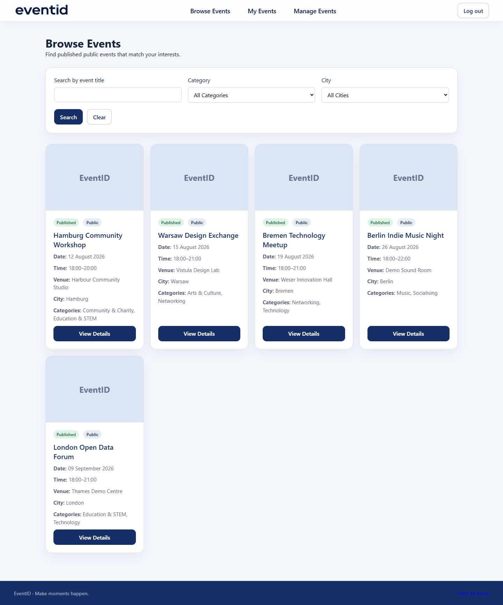
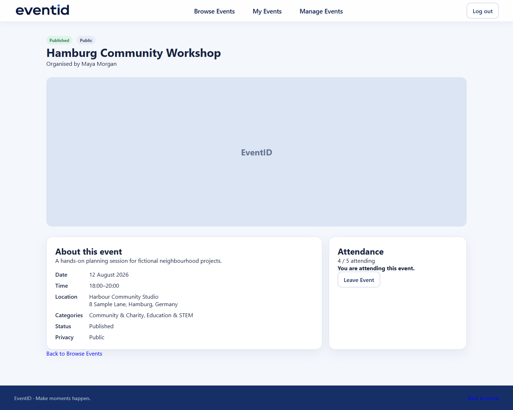
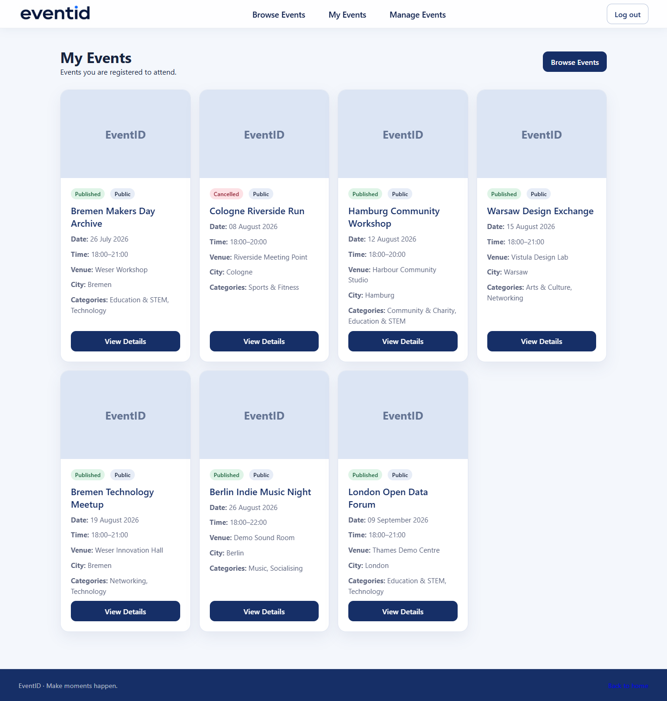
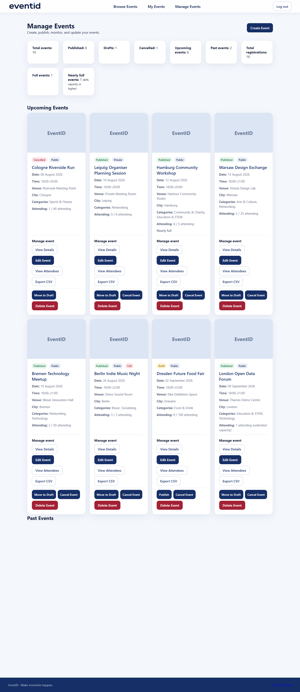
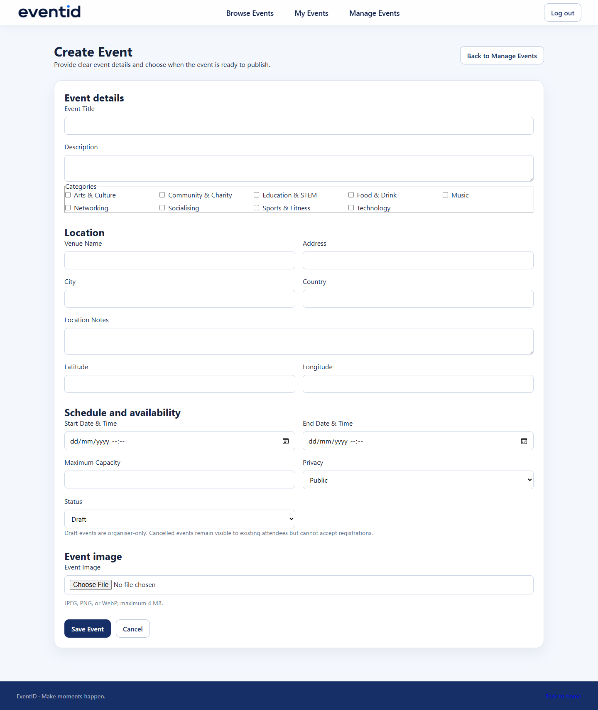

# EventID

EventID is a server-rendered Flask event platform for discovering, attending, and organising events. It combines a polished responsive interface with explicit authorization, concurrency-safe capacity enforcement, secure uploads, migrations, and automated delivery checks.


<details>
<summary>More interface screenshots</summary>









</details>

## Highlights

- Signup, session login, CSRF protection, and rate-limited authentication
- Public/private events with Draft, Published, and Cancelled lifecycle states
- Search, category/city filters, pagination, images, registration, and CSV exports
- Public browsing and Published public event details without an account
- Private, explainable recommendations for authenticated users
- Reusable, manually controlled carousels for public discovery and private recommendations
- Organiser dashboard with lifecycle and capacity statistics
- Accessible keyboard focus, semantic forms, status text, and reduced-motion support
- SQLite development and PostgreSQL production support
- Ruff, Black, pytest, 85% coverage gate, migration checks, and GitHub Actions CI

## Architecture

Flask renders Jinja templates and exposes route blueprints for authentication and events. Flask-SQLAlchemy owns persistence, Flask-Migrate/Alembic owns schema changes, Flask-WTF supplies CSRF and event forms, and Flask-Limiter protects login attempts. See [architecture](docs/architecture.md), [security](docs/security.md), [testing](docs/testing.md), and [deployment](docs/deployment.md).

The core relationships are User → organised Events, User ↔ Attendance ↔ Event, and Event ↔ EventCategory ↔ Category. Attendance uses a composite primary key to prevent duplicate registrations.

Capacity decisions are transactional: SQLite obtains `BEGIN IMMEDIATE`; PostgreSQL locks the event row with `SELECT FOR UPDATE`. Both re-check capacity inside the protected transaction.

Visitors can browse, search, filter, paginate, and view upcoming Published public events without registering. Attendance and all personal or organiser workflows require login. Protected links retain a validated internal destination so a successful login returns the user to the page they requested; external redirect targets are rejected.

Authenticated landing pages show up to six “Events We Think You’ll Like” recommendations. Category affinity is the strongest signal, followed by city affinity, popularity, and earlier start time. The calculation excludes private, non-Published, past, full, already-attended, and user-owned events. Users without history receive popular available upcoming events. Recommendations are calculated at request time from the current user’s attendance only and are never persisted.

The public landing page separates events happening in the next seven days from later upcoming events. Both sections use the same responsive, keyboard-operable carousel component. Personalised recommendations are calculated and rendered only for authenticated users; anonymous requests never execute the recommendation query.

Authenticated navigation also includes Calendar, a server-rendered schedule combining events you attend with events you organise. Organiser-owned Draft, Published, and Cancelled events remain visible to the organiser; attended Published and Cancelled events remain visible to attendees. Event entries link back to their authorised detail pages.

## Local setup

Requires Python 3.12.

```powershell
python -m venv .venv
.\.venv\Scripts\Activate.ps1
python -m pip install -r requirements-dev.txt
Copy-Item .env.example .env
python -m flask --app main:app db upgrade
python -m flask --app main:app seed-demo-data
python -m flask --app main:app run
```

Replace the sample `SECRET_KEY` in `.env`. Generate one with `python -c "import secrets; print(secrets.token_hex(32))"`. Runtime variables are documented in `.env.example`; production requires a secret, PostgreSQL `DATABASE_URL`, HTTPS cookies, persistent upload directory, and preferably shared rate-limit storage.

## Demo

`seed-demo-data` is idempotent and uses fictional data. Development-only accounts are `demo_organiser` and `demo_attendee`, both with password `EventID-demo-2026`. Never enable demo credentials in a real production database.

## Quality checks

```powershell
python -m black --check .
python -m ruff check .
python -m pytest
python -m pytest --cov=app --cov-report=term-missing --cov-fail-under=85
python -m flask --app main:app db check
```

Runtime dependencies are pinned in `requirements.txt`; test and quality tools are isolated in `requirements-dev.txt`. GitHub Actions runs every gate on pushes and pull requests for `develop` and `main`.

## Production deployment

`render.yaml` defines a Render web service, managed PostgreSQL database, persistent upload disk, migration command, Waitress WSGI server, and `/health` check. Connect the repository as a Render Blueprint and review paid resource plans before creating resources. Only `main` auto-deploys. Details, backups, recovery, and environment values are in [deployment](docs/deployment.md).

Local uploads are suitable for development or one instance with a persistent disk. Multi-instance deployment requires shared object storage; EventID intentionally does not pretend a local disk is horizontally scalable.

## Project structure

```text
app/                 application modules, templates, and static assets
migrations/          Alembic migration history
tests/               functional, security, concurrency, and production tests
docs/                architecture, deployment, security, testing, screenshots
.github/workflows/   CI quality gates
main.py              application factory and operational routes
render.yaml          production infrastructure blueprint
```

## Release workflow

Development stays on `develop`. A release is validated, committed and pushed there, merged into `main` with a merge commit, validated again, annotated, and published. Never rewrite release history.

## Versions

- v0.1–v0.4: foundation, authentication, database, and event creation
- v0.5–v0.7: discovery, participation, dashboard, and pagination
- v0.8: security hardening
- v0.9: event management, images, demo data, and UX polish
- v1.0: production configuration, accessible final UI, CI/CD, and operations docs

## Future improvements

Shared object storage, Redis-backed rate limiting, PostgreSQL integration tests, email verification, password reset, and production monitoring are intentionally left as deployer-specific extensions.

## Licence

No licence has been selected. All rights are reserved until the repository owner adds one.
