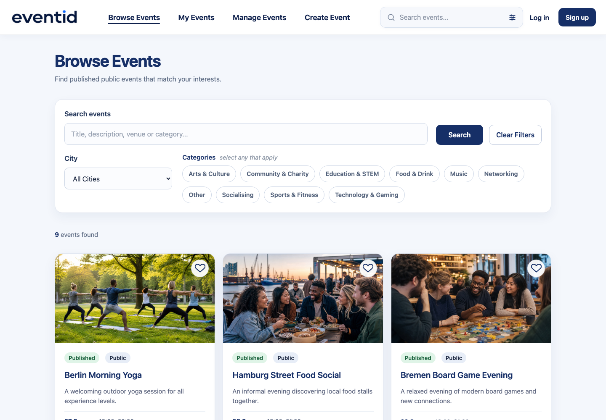
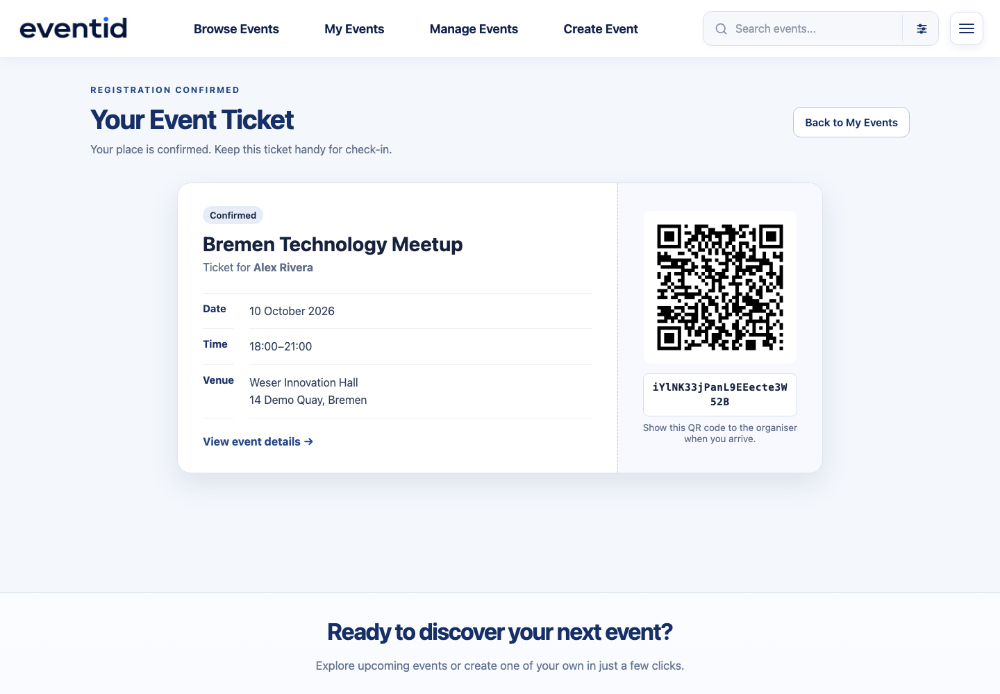
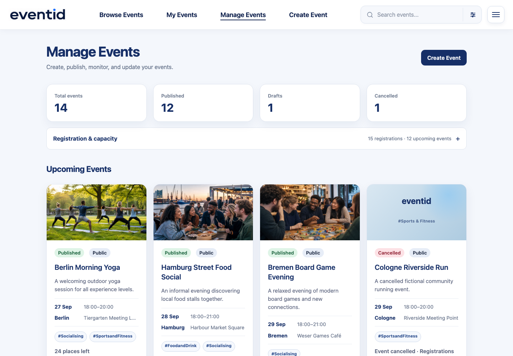
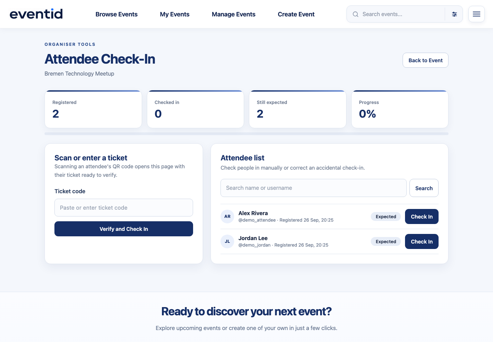

# EventID

EventID is a full-stack event discovery and management application. Attendees can find events, register, organise their calendar and show a QR ticket; organisers can manage events, approve private invitations and check attendees in.

Built with Flask and a relational database, it demonstrates server-side authorization, transactional capacity handling, account security and a responsive interface without a frontend framework.

## Screenshots / Demo

Screenshots below show the current application with disposable, fictional demo data. Run the local demo using the instructions below; no hosted demo URL is currently advertised.



<details>
<summary>Event details, ticket and organiser tools</summary>






</details>

<details>
<summary>Mobile discovery</summary>


</details>

## Features

- Browse and search events by text, location and category; save favourites.
- Create an account, sign in, edit your profile and manage active sessions. Email verification and password recovery are available when a mail provider is configured.
- Register for public events or request approval for private events through expiring invitations and optional email allowlists.
- View My Events, a monthly calendar, downloadable ICS files and Google/Outlook calendar links.
- Open confirmed QR tickets; organisers can verify tickets, check attendees in, undo check-in and export attendee CSVs.
- Create, edit, duplicate, publish and cancel events, with capacity limits, image uploads and owner-only management.
- Responsive desktop/mobile layouts, progressive form feedback and usable discovery without JavaScript.

## Tech Stack

**Backend:** Python 3.12, Flask, Jinja2, Flask-WTF/WTForms, Flask-SQLAlchemy, Flask-Migrate/Alembic and Flask-Limiter.

**Data/runtime:** SQLite locally, PostgreSQL with psycopg 3 in production, Waitress WSGI server, Pillow for validated images, QRCode for tickets and Resend for optional account emails.

**Frontend/tooling:** HTML, CSS and vanilla JavaScript; pytest, coverage, Ruff, Black and GitHub Actions. Direct runtime and development dependencies are pinned in `requirements.txt` and `requirements-dev.txt`.

## Engineering Highlights

- **Relational lifecycle:** users, owned events, categories, favourites, attendance and tracked sessions are backed by constraints and a versioned migration chain.
- **Capacity correctness:** registrations and private approvals lock the event before counting confirmed attendees. SQLite uses `BEGIN IMMEDIATE`; PostgreSQL uses `SELECT FOR UPDATE` so unrelated events can proceed independently.
- **Authorization:** event ownership, invitation access, attendee decisions and ticket/check-in access are enforced on the server. Approval changes a pending request into a confirmed registration with a usable ticket.
- **Security controls:** CSRF protection, restrictive CSP, password hashing, safe login destinations, rate limits, secure production cookies, session revocation and validated image uploads.
- **Verification:** tests exercise user/state transitions, authorization failures, capacity races, email behavior, seeding and schema drift. CI checks formatting, lint, coverage, routes, migrations and tracked-file hygiene.
- **Deployment:** provider PostgreSQL URLs are normalized at configuration time; production requires explicit secrets/database settings and exposes a database-backed health check.

## Architecture

`main.create_app()` loads environment configuration, initializes extensions and registers authentication and event blueprints. Routes validate forms and authorization, use SQLAlchemy transactions to change state, then render Jinja templates or return feedback for vanilla-JavaScript interactions. Images are stored outside the source tree and served through event access checks.

The main flow is discovery → event details → registration → My Events/calendar → ticket. For private events, invitation access → pending request → owner approval precedes ticket issuance; only the event owner can verify or check in that ticket.

See [architecture](docs/architecture.md), [security controls](docs/security.md) and [deployment/recovery](docs/deployment.md) for implementation details.

## Local Setup

Use Python 3.12 and run commands from the repository root:

```bash
git clone https://github.com/WikiPoah/eventid.git
cd eventid
python3 -m venv .venv
source .venv/bin/activate
python -m pip install -r requirements-dev.txt
cp .env.example .env
python -c "import secrets; print(secrets.token_hex(32))"
```

Paste the generated value into `.env` as `SECRET_KEY`. Keep `FLASK_ENV=development`; leave `DATABASE_URL` unset for SQLite. Never commit `.env`. On Windows PowerShell, use `python` instead of `python3`, `.\.venv\Scripts\Activate.ps1` and `Copy-Item .env.example .env`.

```bash
flask --app main:app db upgrade
flask --app main:app seed-categories
flask --app main:app run
```

Open **http://127.0.0.1:5000**. SQLite and uploaded images live in the ignored `instance/` directory. No external database or email provider is needed for the main demo.

## Demo

In a fresh development database:

```bash
flask --app main:app seed-demo-data
flask --app main:app run
```

The seed provides five fictional users, fourteen events, categories, confirmed registrations, favourites, demo images and relative event dates. Re-running it preserves record identities rather than creating duplicates.

| Account | Username | Password |
| --- | --- | --- |
| Attendee — Alex Rivera | `demo_attendee` | `eventid-demo-2026` |
| Organiser — Maya Morgan | `demo_organiser` | `eventid-demo-2026` |

These are **public development/demo credentials**, never real account credentials. Use only a disposable database or a dedicated demo instance without real user data. Production seeding requires explicit `ALLOW_DEMO_SEED=true`; disable it again after seeding.

Suggested five-minute walkthrough:

1. Search for **Berlin Morning Yoga**, open details, then sign up or sign in as the attendee and register.
2. Open **My Events**, the calendar and your ticket. Save a favourite from Browse.
3. In a separate browser/private window, sign in as the organiser. Explore Manage Events and edit or duplicate an event.
4. Open **Leipzig Organiser Planning Session**, copy its invitation link and open it in the attendee window. Request attendance; approve it from the organiser window.
5. Open the newly available attendee ticket. In the organiser window, use Check-in to verify/check in the attendee; repeat to see the already-checked-in state.

The organiser check-in search/manual controls demonstrate the same lifecycle as opening the QR link in an authenticated organiser browser; there is no in-app camera scanner.

## Testing

```bash
python -m pytest -q
python -m pytest --cov=app --cov-report=term-missing --cov-fail-under=85
python -m ruff check .
python -m black --check .
git diff --check
node --check app/static/js/script.js
```

Tests use disposable SQLite databases and upload directories. Migration tests upgrade a fresh database, repeat the upgrade and compare the schema to the models. PostgreSQL startup/schema and concurrency checks have also been exercised locally against a disposable PostgreSQL 16 instance; PostgreSQL is not part of the current CI job.

GitHub Actions runs Python 3.12 checks on pushes/PRs to `main` and `develop`, including an 85% coverage floor, application import/routes and migration drift checks. Node is optional for the JavaScript syntax command. See [testing notes](docs/testing.md).

## Deployment

[`render.yaml`](render.yaml) defines a single Waitress web service, PostgreSQL database and persistent upload disk. Its pre-deploy step upgrades migrations and seeds categories; startup serves `main:app`, and `/health` queries the database.

Production requires `FLASK_ENV=production`, a unique `SECRET_KEY`, `DATABASE_URL` and HTTPS. `postgres://` and `postgresql://` connection URLs are normalized for psycopg 3. Use a persistent `UPLOAD_DIRECTORY`; the Blueprint mounts `/var/data/eventid/event_images`. Configure `RESEND_API_KEY` and a verified `MAIL_FROM` to enable actual email delivery.

For a dedicated hosted demo, seed through Render's **runtime Shell** after deployment, when the upload disk is mounted. Review paid service/database/disk plans before provisioning. Local production-like verification is complete; an actual hosted Render deployment and delivery from a real mail provider still require verification. Follow [deployment instructions](docs/deployment.md).

## Limitations

- The reference deployment is one process/instance with local persistent uploads. Its in-memory rate limits reset on restart; shared limiter storage and object storage are needed before scaling out.
- Email flows require a configured provider; ordinary signup/login/registration work without one.
- Demo accounts are public, and seeded events are fictional. Keep the demo separate from real users and re-seed when refreshing event dates.
- Browser verification used Chromium on desktop/mobile viewports. Wider cross-browser/accessibility review remains useful; the mobile month grid scrolls horizontally.
- This is a portfolio application, with no payments, live operations guarantee or production-scale claim.
