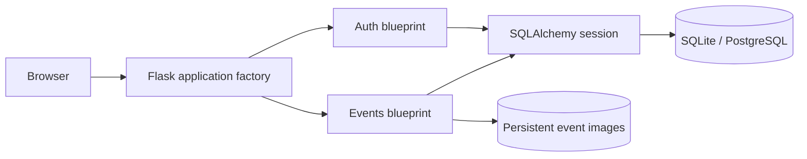

# Architecture

## Request flow

Blueprint routes enforce authorization server-side; templates only decide which valid actions to display. Private, Draft, and Cancelled events pass through the shared visibility policy. All state changes use POST and CSRF protection.

Anonymous visitors may use discovery routes and view Published public events. Personal pages and every state-changing or organiser route retain authentication. Login destinations are limited to absolute internal paths; schemes, hosts, protocol-relative paths, and backslashes are rejected.

## Lifecycle and relationships

An organiser owns many events. Users attend many events through the Attendance table. Events have many categories through EventCategory. An event moves between Draft, Published, and Cancelled; only Published events accept new registrations. Existing attendees retain controlled visibility of cancellations.

SQLite capacity writes use `BEGIN IMMEDIATE`, because SQLite lacks row-level locks. PostgreSQL uses `SELECT FOR UPDATE` on the event row, allowing unrelated events to accept registrations concurrently.

Images are validated by extension, file signature, and size, assigned generated names, and served only after checking access to the owning event. Local persistent storage supports one application instance; multiple instances need shared object storage.

## Recommendations

The authenticated landing page calculates recommendations without storing a profile. One query reads the current user’s attended cities/categories; an aggregated candidate query filters access, lifecycle, ownership, prior attendance, time, and capacity; one eager-load query retrieves categories. At most 40 candidates are ranked and six returned, avoiding N+1 behavior.

Public homepage discovery is queried separately from recommendations and includes only public, Published, non-expired events. A reusable carousel partial renders each section with a unique viewport and local controls. JavaScript measures the current card and CSS gap for each movement and maintains state within that carousel; native horizontal scrolling remains usable without JavaScript. Entrance animation is applied to slide wrappers, while carousel movement uses viewport scrolling, so transforms cannot conflict.

Calendar uses one authorised outer-join query for the current user’s attendance and ownership, then deduplicates naturally by event primary key. Ownership permits Draft visibility; attendance permits Published and Cancelled visibility. Events are split by end time into upcoming and past schedule sections.

Category overlap scores highest, city overlap follows, attendance popularity supports cold starts, and start time plus event ID provide deterministic tie-breaking. No profile attributes or another user’s private history are used.

CI validates format, lint, tests, coverage, import/routes, migrations, and tracked-file hygiene. Render deploys stable `main`, runs migrations before start, serves Waitress behind HTTPS proxying, and checks `/health`.
